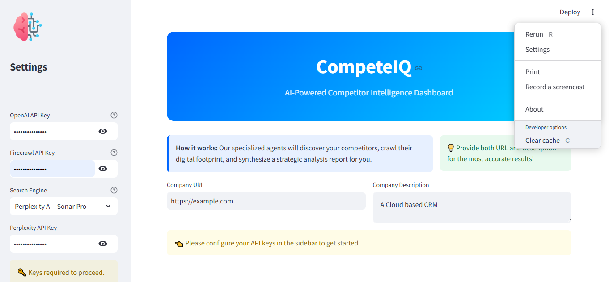

# CompeteIQ: AI Competitor Intelligence Agent Team



CompeteIQ is a sophisticated competitive analysis platform powered by **Firecrawl**, **Exa AI**, and the **Agno AI Agent framework**. It orchestrates a team of specialized AI agents to discover competitors, crawl their digital footprint, and generate actionable strategic reports.

## 🚀 Features

- **Multi-Agent Orchestration**:
    - **Scout Agent**: Uses Exa AI or Perplexity to discover competitors based on your URL or business description.
    - **Crawl Agent**: Powered by Firecrawl to perform deep extractions of competitor features, pricing, and tech stacks.
    - **Strategy Agent**: Synthesizes raw data into high-level competitive analysis and growth opportunities.
- **Dynamic Competitive Discovery**: Find competitors you didn't even know you had via semantic search.
- **Deep Data Extraction**: Automatically extracts:
    - Pricing tiers and models
    - Core feature sets
    - Tech stack and infrastructure
    - Marketing focus and customer sentiment
- **Actionable Reports**: Generates detailed reports with market gaps, weaknesses to exploit, and product recommendations.

## 🛠️ Requirements

The application requires the following libraries (all included in `requirements.txt`):

- `agno`: The agent framework
- `firecrawl-py`: Web crawling and extraction (v4.23.0+)
- `exa-py`: Neural search for competitor discovery
- `ddgs`: DuckDuckGo search integration
- `streamlit`: Dashboard UI
- `pandas`: Data comparison tables
- `pydantic` & `requests`: Data handling and API calls

**API Keys Needed:**
- OpenAI (for the LLM "brains")
- Firecrawl (for web extraction)
- Exa or Perplexity (for discovery)

## 🏃 How to Run

1. **Clone and Navigate**:
   ```bash
   git clone https://github.com/mars01hash/CompeteIQ.git
   cd CompeteIQ
   ```

2. **Install Dependencies**:
    ```bash
    pip install -r requirements.txt
    ```

3. **Launch the App**:
    ```bash
    streamlit run competitor_agent_team.py
    ```

## 💡 Usage

1. **Configure**: Enter your API keys in the sidebar.
2. **Analyze**: Input your company URL or a description of what you do.
3. **Review**: Watch the agents collaborate to build your comparison table and strategic report.


